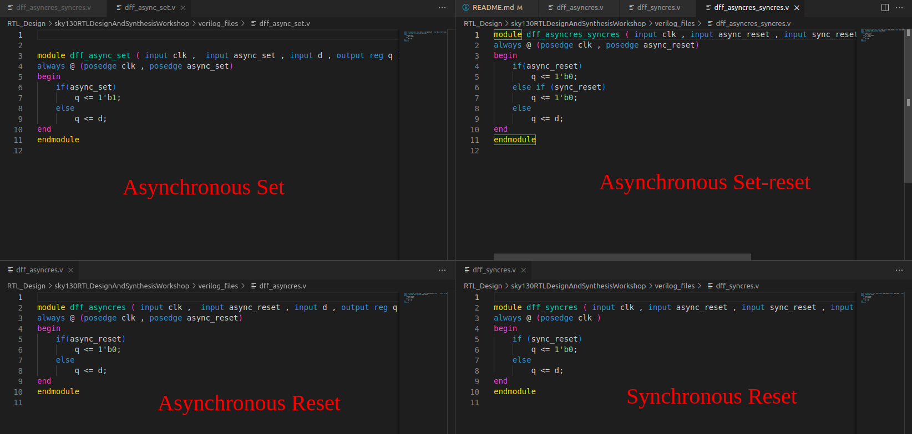
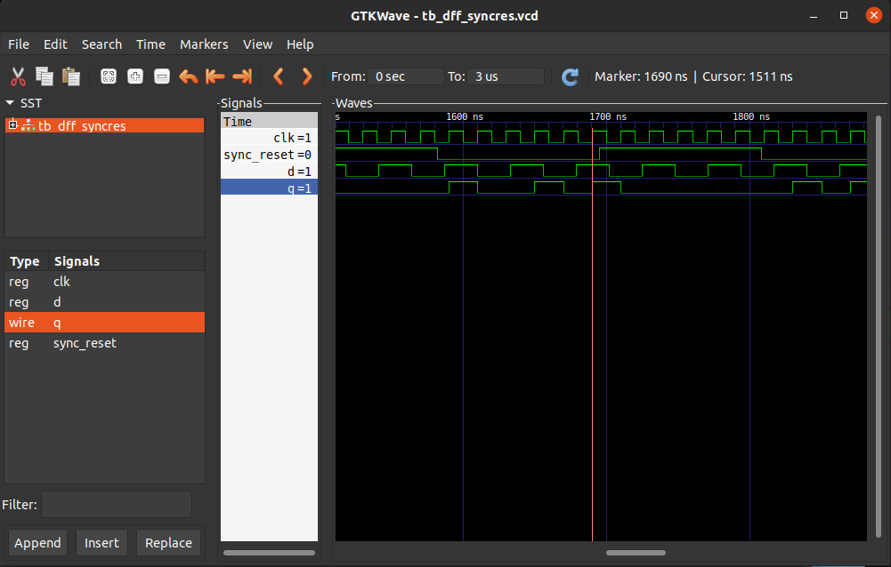
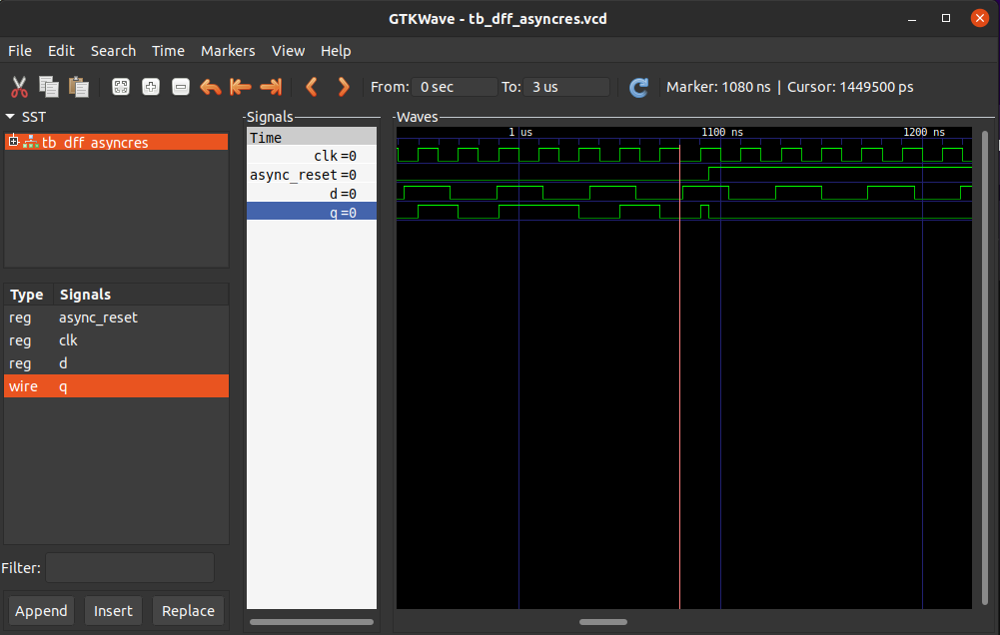
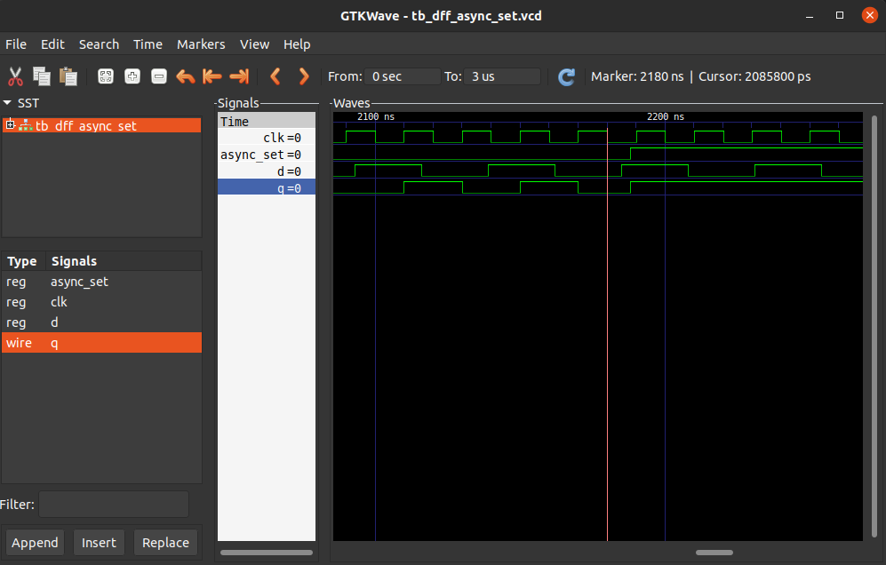

# Synopsis_RTL2GDSII_SFAL

Digital chip design transforms a high-level functional description into a manufacturable physical chip. The process follows key steps: starting with **specification**, followed by **RTL design** using hardware description languages like Verilog or VHDL, **verification**, **synthesis** into a gate-level netlist, **place and route (PnR)**, and final **timing, power, and physical verification** before the chip is ready for fabrication.

This repository demonstrates the entire RTL-to-GDSII flow using Synopsys tools, providing a streamlined guide from RTL design to physical implementation. It covers each stage, offering insights into optimizing digital chip design workflows.

## Tools Overview

This project uses several essential tools to facilitate the digital chip design flow, from synthesis to simulation and waveform analysis:

1. **Yosys**:  
   Yosys is an open-source framework for RTL synthesis. It converts RTL code (written in Verilog or VHDL) into a gate-level netlist and provides optimization features to meet timing and area constraints.

   <details>
      <summary> 🛠️Installation Steps:</summary>

      ```bash
      git clone https://github.com/YosysHQ/yosys.git
      cd yosys
      sudo apt-get install build-essential clang bison flex \
         libreadline-dev gawk tcl-dev libffi-dev git \
         graphviz xdot pkg-config python3 libboost-system-dev \
         libboost-python-dev libboost-filesystem-dev zlib1g-dev
      make config-gcc
      make 
      sudo make install
     ```

   </details>  

2. **Icarus Verilog (Iverilog)**:  
   Iverilog is a free and open-source Verilog simulation tool. It allows for compiling and simulating Verilog code, making it an essential tool for functional verification of RTL designs.

   <details>
      <summary> 🛠️Installation Steps:</summary>

   ```bash
   sudo apt-get install iverilog
   ```

   </details>

3. **GTKWave**:  
   GTKWave is an open-source waveform viewer used for analyzing simulation results. It helps visualize signals and detect issues in the timing and functionality of the design.

   <details>
      <summary> 🛠️Installation Steps:</summary>

   ```bash
   sudo apt install gtkwave
   ```

   </details>

## Synthesis

Synthesis in digital VLSI design is the process of translating high-level hardware description language (HDL) code, often in RTL (Register Transfer Level) form, into a gate-level netlist. This netlist represents the circuit in terms of basic logic gates and components. Synthesis tools ensure that the design meets specific constraints, such as timing, area, and power, to facilitate the physical implementation.

### ⭐ Simulation to Verify RTL

RTL simulation is the initial step to validate the functionality of the RTL code. This process uses testbenches to simulate the behavior of the RTL design, ensuring it functions as expected before synthesis. RTL simulation helps identify and correct logical and functional issues, enabling designers to confirm that the design meets requirements.

   <details>
      <summary> 🛠️Implementation using GTKwave</summary>

- **Prepare Verilog Files**
   - Ensure you have:
     - **Verilog source file** (`specfile.v`) — your design under test.
     - **Testbench file** (`testbench.v`) — provides input stimulus and checks the output.

- **Run Icarus Verilog**
   - Use Icarus Verilog to compile your files and create an executable:
     ```bash
     iverilog <specfile.v> <testbench.v>
     ```
   - This produces an `a.out` executable file.

- **Execute Simulation to Generate a VCD File**
   - Run the `a.out` file to generate a **Value Change Dump (VCD)** file:
     ```bash
     ./a.out
     ```
   - This creates `file.vcd`, which stores signal changes over time.

- **View Simulation in GTKWave**
   - Open the `.vcd` file in GTKWave to analyze the simulation:
     ```bash
     gtkwave file.vcd
     ```
   - Inspect signal waveforms and verify design functionality in GTKWave.


   </details>

### ⭐ Logic Synthesis

Logic synthesis is the process of converting RTL into a gate-level representation by mapping logic elements to actual hardware gates. Synthesis tools use timing, power, and area constraints to optimize the design, generating a netlist that adheres to the design's specifications. This netlist is essential for subsequent stages, such as placement and routing.

   <details>
      <summary> 🛠️Implementation using Yosys</summary>

- **Load the Library**
   - Load the standard cell library to define available cells for synthesis:
     ```bash
     read_liberty -lib <library_path>/<library_file>.lib
     ```

- **Load the RTL Design**
   - Load your Verilog RTL design file:
     ```bash
     read_verilog <design_file>.v
     ```

- **Declare the Top Module**
   - Specify the top-level module to be synthesized:
     ```bash
     synth -top <top_module_name>
     ```

- **Run the Synthesis**
   - Perform the synthesis step, mapping the design to the cells in the library:
     ```bash
     abc -liberty <library_path>/<library_file>.lib
     ```

- **Generate the Netlist Verilog File**
   - Write the synthesized design to a Verilog file. Use `-noattr` to avoid additional attributes:
     ```bash
     write_verilog -noattr <output_netlist_file>.v
     ```

- **View the Output Summary**
   - A summary of the synthesis results, including details on used cells and wiring, will be displayed.

- **View Flow Chart of Cells and Wires**
   - Use the `show` command to generate a flow chart of the synthesized design:


   </details>

### ⭐ Understanding .lib Files

Library files (often with the .lib extension) provide the synthesis tool with detailed specifications about the cells and components available in a particular technology. These files define the characteristics of each cell type, including timing, power consumption, and area, which the synthesis tool uses to optimize the design according to specified constraints.

A .lib file typically includes multiple variants of logic gates to meet different performance requirements. For example, fast and slow cells are included to satisfy the setup and hold timing constraints, respectively. Faster cells drive more current to quickly charge and discharge the capacitive load in a circuit, achieving low delay. However, this increased speed comes at the cost of greater area and power usage, as faster cells require wider transistors. The synthesis tool selects appropriate cells based on the design’s needs, balancing speed, area, and power to meet timing requirements effectively.

### ⭐ Hierarchical vs. Flat Synthesis

**Hierarchical Synthesis**  
In hierarchical synthesis, the design is divided into separate modules, each synthesized individually. This approach is ideal for large designs, as it reduces memory usage and synthesis time by focusing on each module independently. It supports modularity and simplifies debugging since changes can be made to specific modules without re-synthesizing the entire design.

<details>
<summary> 🛠️Implementation using Yosys</summary>

By default, synthesizing a top-level module in Yosys employs hierarchical synthesis, where the hierarchy in the generated netlist is maintained. This can be observed in the example below, where both the block diagram and the generated netlist showcase the preserved module hierarchy.


</details>

**Flat Synthesis**  
Flat synthesis treats the design as a single block, synthesizing everything together. This can yield more optimized results in terms of area and speed, but it’s resource-intensive and impractical for large designs. Flat synthesis works best for smaller circuits where global optimizations can provide performance benefits.

<details>
<summary> 🛠️Implementation using Yosys</summary>

The `flatten` command in Yosys converts the design to a flat structure, eliminating all hierarchy. This transformation can be seen in the example below, where the figures illustrate the loss of hierarchy in the flattened design.


</details>

### ⭐ Synthesizing and simulating Flops

**What are Flops?**  
Flip-flops (flops) are sequential elements that store binary data based on a clock signal’s edge. They form the building blocks for registers, counters, and other timing-dependent components.

**Importance of Flops**  
Flops are essential for stable, clock-synchronized data storage and transfer, critical to maintaining timing consistency across a design. They also enable pipelining for performance optimization. Proper placement of flops during synthesis is crucial for meeting timing requirements and minimizing power consumption.

<details>
<summary> 🛠️Flops Simulation</summary>

**Synchronous vs. Asynchronous Flip-Flops**  

- **Synchronous Flip-Flops**: These flip-flops change state only in response to a clock signal, making them ideal for designs where timing control is critical. All data transitions are aligned to the clock, ensuring predictable behavior.
- **Asynchronous Flip-Flops**: These flip-flops can change state independently of the clock, triggered directly by inputs. While they allow faster responses to changes, they can introduce timing uncertainty, making them suitable for specific cases like asynchronous resets.

**Set-Reset Flip-Flops**  

- Set/reset flip-flops have dedicated **set** or **reset** inputs to force the output to a high (set) or low (reset) state, overriding other inputs. These are useful for initializing states or enforcing specific conditions at any time during operation.

Below is a screenshot showing RTL code examples of these flip-flops and their corresponding simulation waveforms.

Synchronous reset

Asynchronous reset

Asynchronous set


</details>

<details>
<summary> 🛠️Flops Synthesis</summary>

Asynchronous reset

Synchronous reset

Synchronous reset : Note the interesting optimization in synthesized design

</details>

### ⭐ Optimizations in Digital Design

**Combinational Logic Optimization**

Combinational logic can be optimized by identifying constant signals within the circuit, known as *constant propagation*, to simplify the design. Larger combinational circuits can further benefit from Boolean logic optimization or Karnaugh Maps (K-MAPS), reducing the complexity of logic expressions and enhancing efficiency.

**Sequential Logic Optimization**

Sequential logic optimization targets areas like unnecessary flip-flops and state reduction. For instance:

- **Removal of Redundant Flip-Flops**: If a flip-flop’s output (Q) remains unchanged (e.g., when D is tied to 0 in an async reset), the flip-flop can be removed to streamline the circuit.
- **State Optimization**: Eliminates unused states to simplify the state machine.
- **Cloning**: Reduces interconnect delays by duplicating a flip-flop whose output feeds multiple distant flops, placing each clone close to its destination.
- **Re-timing**: Adjusts the placement of combinational logic between flip-flops, redistributing it to optimize the slack time and increase the maximum operating frequency.

### ⭐ Gate-Level Simulation (GLS) and Simulation Mismatch

**Gate-Level Simulation (GLS)** verifies the synthesized netlist against the design testbench by simulating with Verilog models of the logic gates. This post-synthesis step is crucial for validating that the design's timing and logical functionality align with expectations from the RTL description.

**Why GLS?**

GLS is essential for:

- **Timing Verification**: Ensuring that the generated netlist meets timing constraints and performs as expected.
- **Identifying Synthesis-RTL Mismatches**: Detecting discrepancies between the synthesized design and the original RTL.

**Common Causes of Synthesis-RTL Mismatches**

1. **Sensitivity List Issues**: In Verilog, an incomplete sensitivity list (missing signals that should trigger updates) can cause the simulator to overlook essential changes, resulting in incorrect behavior in simulation versus synthesis.

2. **Blocking vs. Non-Blocking Assignments**: Improper use of blocking (`=`) and non-blocking (`<=`) assignments can lead to mismatches. Blocking assignments, which execute in sequence, can alter the design's intended functionality. For sequential logic, non-blocking assignments are preferred to avoid unintended ordering issues.

3. **Other Sources of Mismatches**:
   - **Blocking Statement Conflicts**: Misuse in conditional structures (e.g., `if`, `case`, `for`, `generate`) can lead to simulation and synthesis differences.
   - **Incomplete `If` Statements**: Missing cases in `if` conditions may cause unintended latches, complicating the synthesis outcome.
   - **Incomplete or Partial `Case` Statements**: Missing or overlapping conditions in `case` statements can similarly result in unintended latches or misinterpretations during synthesis.
   
### ⭐ Synthesis Workflow with Synopsys Design Compiler

Design constraints play a vital role in guiding synthesis tools to select the most suitable cells, balancing timing, power, and area objectives. Synopsys Design Constraints (SDC) are used to provide these specifications to the design compiler, ensuring optimal implementation. SDC is an industry-standard format based on the TCL (Tool Command Language), and it encodes constraints in terms of timing, power, and area.

> Design Compiler (DC) uses `.db` files rather than `.lib` files for processing standard cells.*

### ⭐ Synthesis Workflow

The typical workflow for synthesis in Design Compiler is as follows:

1. **Read Standard Cells and Technology Library (.lib)**  
   Load the standard cells and technology libraries, which provide the cell-level information needed for synthesis.

2. **Read the Design (Verilog and Design Library)**  
   Import the design in Verilog format and link to the design library.

3. **Read SDC Constraints**  
   Apply the SDC file, which supplies timing, power, and area constraints to guide synthesis.

4. **Link the Design**  
   Link the design, ensuring that all modules and dependencies are properly resolved.

5. **Synthesize the Design**  
   Perform synthesis to optimize the design based on the constraints provided.

6. **Generate Output Netlist and Reports**  
   Export the synthesized netlist and generate relevant reports for timing, area, and power.

<details>
<summary> 🛠️Using Synopsys Design Compiler in Command Line </summary>

1. Start the C-shell to set up the environment:
   ```csh
   csh
   ```
2. Launch Design Compiler shell:
   ```csh
   dc_shell
   ```
3. Import the required databases and libraries:
   ```tcl
   read_db <path_to_database>
   set target_library <path_to_target_library>
   set link_library {* <path_to_link_library>}
   ```
   > The `set link_library [* <path>]` option ensures that the library is not overwritten.

4. Link the design:
   ```tcl
   link
   ```
5. Compile the design:
   ```tcl
   compile
   ```
6. Export the synthesized netlist in Verilog format:
   ```tcl
   write -format verilog -output <output_filename>.v
   ```
7. Export the synthesized design in DDC format:
   ```tcl
   write -format ddc -output <output_filename>.ddc
   ```

</details>

<details>
<summary> 🛠️Using Design Vision (GUI)</summary>

1. Start C-shell:

   ```csh
   csh
   ```

2. Launch Design Vision GUI:

   ```csh
   design_vision
   ```

3. Initialize the GUI:

   ```tcl
   start_gui
   ```

4. Read the DDC file (if available):

   ```tcl
   read_ddc <design_name>.ddc
   ```

   

</details>

### ⭐ Automating Tasks with `.synopsys_dc.setup`

The `.synopsys_dc.setup` file can be created in the user directory to store common setup commands and automate repetitive tasks. This file can include commands for setting up libraries, reading constraints, and configuring other essential options, streamlining the setup process for Design Compiler.

### ⭐ TCL Scripting

TCL (Tool Command Language) is a powerful scripting language widely used in EDA tools like Synopsys Design Compiler to automate and customize synthesis processes. It enables you to write scripts for automating tasks, setting constraints, and querying design data, thus enhancing productivity and efficiency. For a quick reference on common commands and syntax, check out this [TCL script cheat sheet](https://www.gibbard.me/tcl_script_cheatsheet/).

### ⭐ Static Timing Analysis (STA)

Static Timing Analysis (STA) is a method used to verify the timing performance of a digital circuit without requiring simulation. It calculates the timing of a design by analyzing the paths between input and output pins, ensuring that all timing constraints are met. Timing constraints are critical in defining the operational limits of a circuit and are essential for the correct functioning of the synthesized design.

#### Timing Constraints

Setup and hold constraints are two fundamental timing requirements in STA. Setup constraints specify the **maximum delay** allowed for data to propagate through combinational logic before being captured by a flip-flop. This ensures that data arrives and is stable before the clock edge triggers the capturing flip-flop, thus preventing setup violations. On the other hand, hold constraints specify the **minimum delay** required for data to remain stable after the clock edge. They ensure that data is held long enough to be correctly captured by the flip-flop, preventing hold violations. Both constraints are crucial for determining the allowable delays in the data path.

#### Delay Calculation

The delay in a circuit depends on several factors, primarily the characteristics of the cells used and the fanout of the signals. **Cell delay** is the intrinsic delay associated with a cell, as provided in the standard cell library. **Fanout** refers to the number of gates driven by a signal, which affects the load capacitance and, consequently, the delay. Accurate delay calculation is essential for meeting the timing constraints and ensuring reliable circuit operation.

#### Timing Paths

Understanding timing paths is essential for effective STA. Timing paths are the routes that signals take from one point to another in a circuit. The main types of timing paths include:

- **Register-to-Register Paths**: Data paths between flip-flops.
- **Input-to-Register Paths**: Paths from input ports to flip-flops.
- **Register-to-Output Paths**: Paths from flip-flops to output ports.
- **Input-to-Output Paths**: Combinational paths from input ports directly to output ports.

Analyzing these paths helps in identifying critical paths and optimizing the design to meet the specified clock constraints.

#### Clock Modeling

Accurate clock modeling is vital for correct timing analysis. It involves defining the clock period, waveform, and transitions, including the rise and fall times of the clock signal. Output loads, such as load capacitances on clock outputs, also affect the delay and must be considered. Proper clock modeling ensures that the synthesis tool can optimize the combinational logic based on the specified clock.

#### I/O Modeling

Input/Output (I/O) modeling addresses both external and internal path delays. **External path delays** refer to delays outside the chip, such as board or interconnect delays, while **internal path delays** are delays within the chip, between the I/O pins and internal logic. Modeling these delays provides better directives to the compiler, enabling it to optimize the design more effectively.

#### Pin Unateness

Unateness describes the relationship between the input and output transitions of a cell. A pin is **positive unate** if a rising input causes a rising output and **negative unate** if a rising input causes a falling output. Understanding the unateness of pins is crucial for determining how transitions propagate through the logic, which affects timing analysis and optimization.

#### Library Characteristics

Standard cell libraries use **lookup tables** to provide delay values based on different load capacitances and input transition times. These tables allow the synthesis tool to calculate accurate delays for various conditions. **Timing types for sequential gates** define the behavior of sequential elements, including setup and hold times, which are essential for timing analysis.

<details>
<summary> 🛠️Querying Properties in Synopsys Design Compiler</summary>

Using Synopsys DC, you can query and manipulate various properties of libraries and cells to aid in synthesis and analysis. For instance, to list all loaded libraries, you can use the `list_lib` command. To retrieve all sequential cells in the loaded libraries, the following command can be used:

```tcl
get_lib_cells * -filter "is_sequential==true"
```

To get all cells with names containing "and," you can use:

```tcl
get_lib_cells */*and*
```

You can iterate over these cells and perform actions using a loop:

```tcl
foreach_in_collection my_lib_cell [get_lib_cells */*and*] {
    set my_lib_cell_name [get_object_name $my_lib_cell]
    echo $my_lib_cell_name
}
```

To view all pins of a specific cell, use:

```tcl
get_lib_pins <cellname>/*
```

And to iterate over the pins to get their names and directions:

```tcl
foreach_in_collection my_pins [get_lib_pins <cellname>/*] {
    set my_pin_name [get_object_name $my_pins]
    set pin_dir [get_lib_attribute $my_pin_name direction]
}
```

Replace `<cellname>` with the actual name of the cell you are inspecting. By leveraging these commands, you can extract valuable information about cells and their properties, facilitating better synthesis and optimization of your design.

</details>
